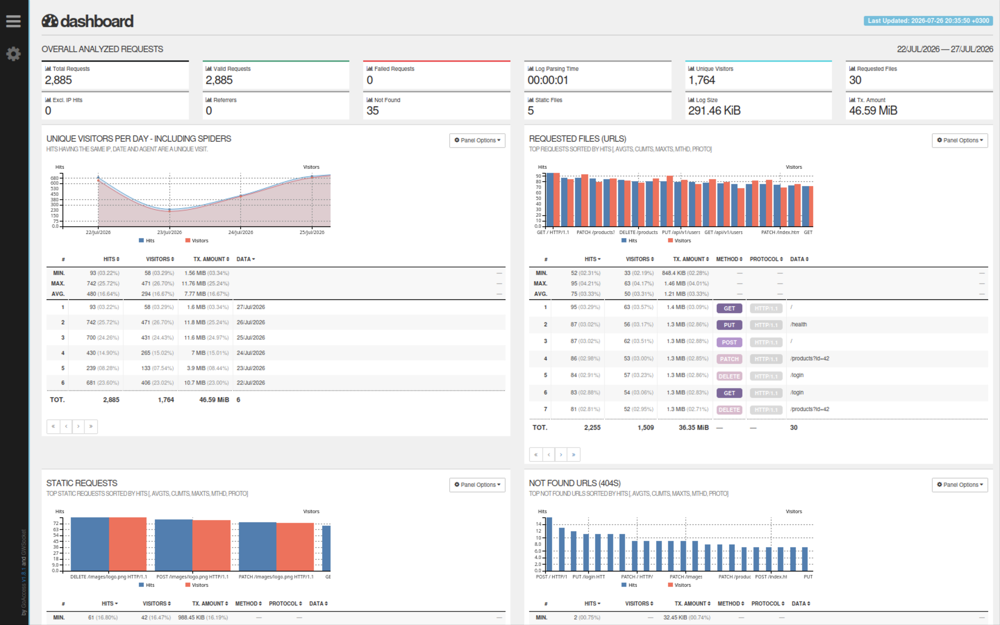
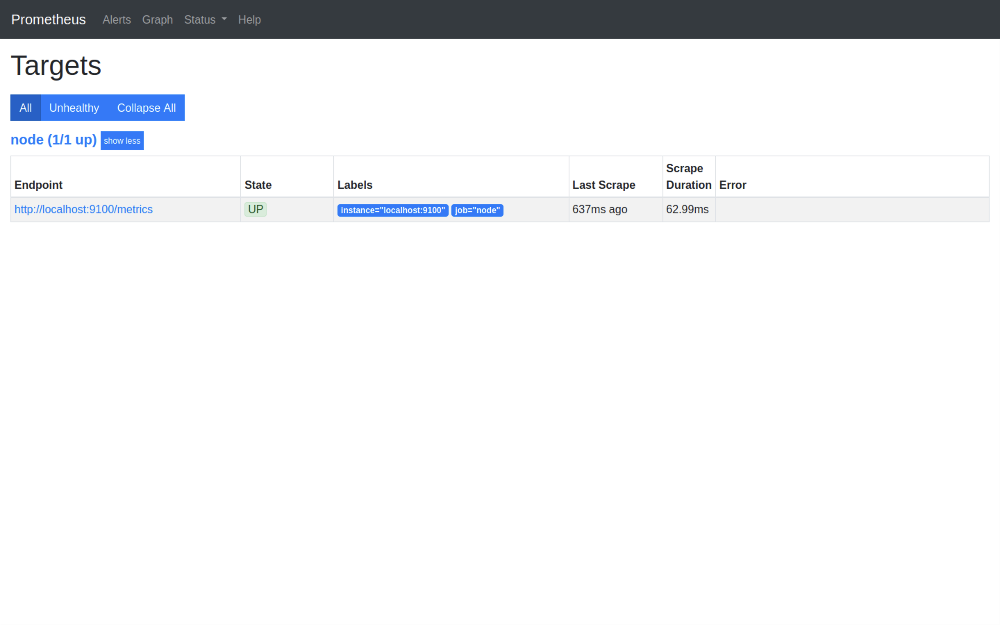
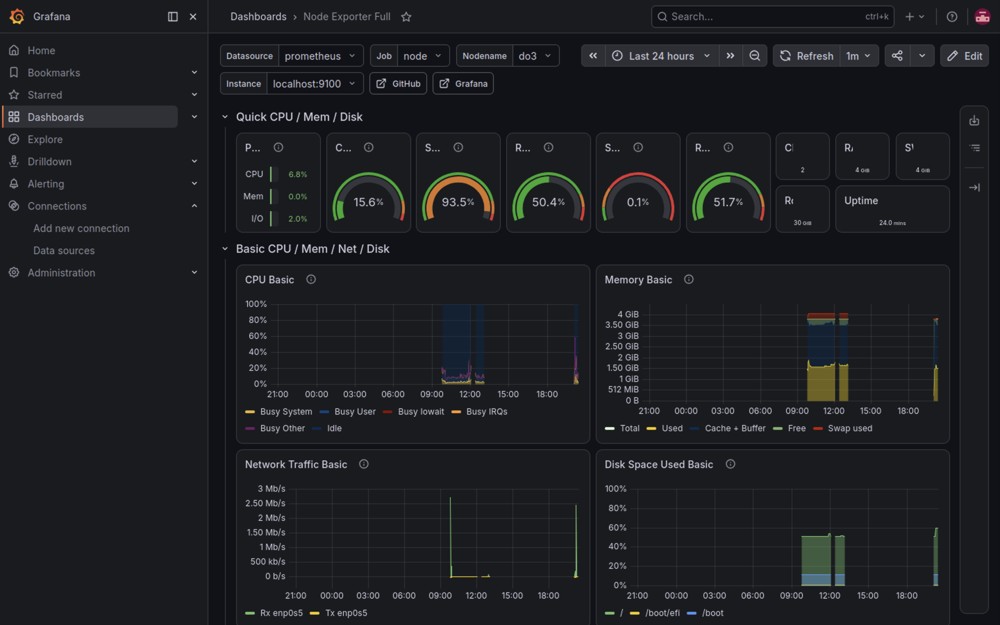
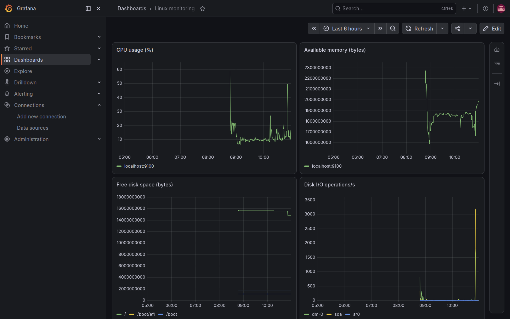

# Bash. Инструменты мониторинга и анализа логов

## GoAccess

### Что это

**GoAccess** — это консольный анализатор логов веб-серверов и других приложений.
Он позволяет быстро анализировать большие лог-файлы и отображать статистику в
терминале или в виде веб-интерфейса в режиме реального времени.

GoAccess особенно полезен при анализе журналов работы серверов без необходимости
писать собственные скрипты.

---

### Основные возможности

- анализ логов в реальном времени;
- отображение статистики в терминале;
- генерация HTML-отчётов;
- просмотр количества запросов;
- анализ HTTP-кодов ответов;
- определение наиболее посещаемых страниц;
- просмотр IP-адресов клиентов;
- анализ используемых браузеров и операционных систем.

---

### Когда применяется

GoAccess используют при:

- анализе логов веб-сервера (Nginx, Apache);
- поиске ошибок после развертывания приложения;
- анализе нагрузки на сервер;
- поиске подозрительной активности;
- мониторинге посещаемости сайта.

---

### Пример применения

После запуска веб-приложения можно проанализировать лог Nginx и определить:

- сколько пользователей посетило сайт;
- какие страницы открывались чаще всего;
- какие запросы завершились ошибками;
- какие IP-адреса создавали наибольшую нагрузку.

### Интерфейс GoAccess



---

## Prometheus

### Что это

**Prometheus** — система мониторинга и база данных временных рядов (Time Series
Database, TSDB).

В отличие от обычных реляционных баз данных, Prometheus хранит показатели вместе
с отметкой времени. Это позволяет отслеживать изменение состояния системы во
времени.

Prometheus регулярно собирает метрики с серверов, приложений, контейнеров и
различных сервисов.

---

### Основные возможности

- хранение метрик;
- сбор данных через HTTP;
- хранение временных рядов;
- выполнение запросов на языке PromQL;
- оповещение о проблемах через Alertmanager;
- интеграция с Grafana.

---

### Когда применяется

Prometheus используют для мониторинга:

- серверов Linux;
- Docker-контейнеров;
- Kubernetes;
- баз данных;
- веб-приложений;
- виртуальных машин;
- сетевого оборудования;
- микросервисов.

---

### Пример применения

Prometheus может собирать следующие показатели:

- загрузку процессора;
- использование оперативной памяти;
- свободное место на диске;
- сетевой трафик;
- количество запросов в секунду;
- время ответа приложения.

Эти данные позволяют своевременно обнаружить перегрузку системы или отказ
сервисов.

### Интерфейс Prometheus



---

## Grafana

### Что это

**Grafana** — платформа для визуализации и анализа данных.

Она не собирает информацию самостоятельно, а подключается к различным источникам
данных (например, Prometheus) и отображает их в виде графиков, таблиц и
дашбордов.

Grafana значительно упрощает анализ состояния инфраструктуры.

---

### Основные возможности

- создание интерактивных дашбордов;
- отображение данных в виде графиков;
- построение таблиц и диаграмм;
- фильтрация данных;
- настройка переменных;
- совместная работа с несколькими источниками данных;
- создание оповещений.

---

### Основные элементы

#### Панель (Panel)

Панель — отдельный элемент дашборда, отображающий один показатель.

Например:

- загрузка процессора;
- использование памяти;
- количество HTTP-запросов.

---

#### Дашборд (Dashboard)

Дашборд — набор панелей, объединённых в одном окне.

На одном дашборде можно одновременно наблюдать:

- CPU;
- RAM;
- диск;
- сеть;
- количество ошибок приложения;
- состояние сервисов.

---

### Когда применяется

Grafana используется для:

- мониторинга серверов;
- анализа производительности приложений;
- контроля инфраструктуры;
- визуализации метрик Prometheus;
- наблюдения за состоянием Docker и Kubernetes;
- анализа работы баз данных.

---

### Пример применения

Во время работы приложения Grafana может отображать:

- текущую загрузку процессора;
- использование памяти;
- количество активных пользователей;
- скорость обработки запросов;
- число ошибок за выбранный период.

Это позволяет быстро обнаружить проблему и определить момент её возникновения.

### Нагрузочное тестирование

Чтобы проверить дашборд, можно создать контролируемую нагрузку на CPU, память и
диск:

```bash
stress -c 2 -i 1 -m 1 --vm-bytes 32M -t 10s
```

Во время выполнения команды в Grafana должны изменяться показатели загрузки
процессора, доступной памяти и дисковых операций.



---

# Связка инструментов

На практике эти инструменты чаще всего используются совместно.

```text
Сервер / Приложение
          │
          ▼
Сбор метрик
(Prometheus)
          │
          ▼
Хранение данных
(Time Series Database)
          │
          ▼
Визуализация
(Grafana)
```

Для анализа логов отдельно может использоваться GoAccess.

### Prometheus и Grafana вместе



```text
Логи веб-сервера
        │
        ▼
     GoAccess
        │
        ▼
HTML-отчёт или статистика в терминале
```

---

# Краткое сравнение

| Инструмент | Назначение                   |
| ---------- | ---------------------------- |
| GoAccess   | Анализ логов                 |
| Prometheus | Сбор и хранение метрик       |
| Grafana    | Визуализация и анализ метрик |

---

# Практическое применение

Ниже — небольшая локальная лаборатория. Она не требует отдельной виртуальной
машины: достаточно Docker и Docker Compose. Файлы лаборатории находятся в
каталоге [`lab`](lab/).

## Prometheus, Node Exporter и Grafana

Перейдите в каталог лаборатории и запустите сервисы:

```bash
cd docs/bash/lab
docker compose up -d
```

Откройте Prometheus: `http://localhost:9090`. На странице **Status → Targets**
цель `node-exporter` должна иметь статус **UP**. Попробуйте выполнить запросы в
поле Expression:

```promql
up
node_memory_MemAvailable_bytes
rate(node_cpu_seconds_total[1m])
```

Grafana доступна по адресу `http://localhost:3000`; начальные логин и пароль —
`admin` / `admin`. Источник Prometheus и учебный дашборд **Local system**
подключаются автоматически. На нём можно посмотреть CPU, доступную память и
свободное место на диске.

Чтобы увидеть изменение метрик, создайте короткую нагрузку в отдельном
терминале:

```bash
docker run --rm --cpus=1 alpine sh -c 'yes > /dev/null'
```

Остановите контейнер сочетанием `Ctrl+C`, затем обновите дашборд Grafana. Для
остановки всей лаборатории выполните `docker compose down` из каталога `lab`.

> В Docker Desktop Node Exporter показывает метрики Linux-окружения Docker, а не
> напрямую macOS или Windows. На Linux он показывает метрики хоста.

## GoAccess на примере лога

В [`lab/goaccess/access.log`](lab/goaccess/access.log) есть небольшой журнал
Nginx в формате `combined`. Установите GoAccess и постройте HTML-отчёт:

```bash
# Ubuntu / Debian
sudo apt install goaccess

goaccess docs/bash/lab/goaccess/access.log \
  --log-format=COMBINED \
  -o /tmp/goaccess-report.html
```

Откройте `/tmp/goaccess-report.html` в браузере. В отчёте можно увидеть коды
ответов, наиболее запрашиваемые URL, IP-адреса и браузеры. Чтобы
поэкспериментировать, добавьте в копию лога несколько строк с кодами `404` или
`500` и создайте отчёт ещё раз.

## Что изучить дальше

- Добавьте в [`prometheus.yml`](lab/prometheus.yml) ещё один `scrape_config` и
  проверьте, что новая цель появилась в Prometheus.
- В Grafana создайте свою панель с запросом
  `rate(node_network_receive_bytes_total[1m])`.
- Импортируйте популярный готовый дашборд Node Exporter по ID `1860` через
  **Dashboards → New → Import** и сравните его с учебным дашбордом.
